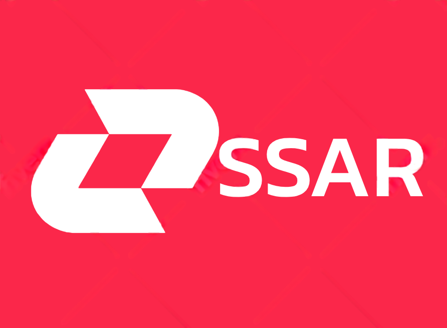

<h4 align="center">
  <a href="https://blog.ssar-group.com">Blogs</a>
  •
  <a href="mailto:contactus@ssar-group.com">Contact Us</a>
</h4>

## The company's mission

We are working to provide tools for the development of new technologies, powerful tools for video games and to create an anti-cheat program to combat cheating in online games.

## Tools, Services

We have developed :

- [Vecteur Anti-Cheat](https://dev.ssar-group.com/gamedev/ac-vecteur) : A powerful anti-cheat uses AI.

- [ASL](https://dev.ssar-group.com/asl) : A complete framework for all utilities.

- [PulsarUI](https://dev.ssar-group.com/pulsarui) : A modern UI based on React.

## Documentation

Visit [our docs](https://doc.ssar-group.com/) to view the full documentation.

## Security

If you discover a security vulnerability in our tools, we encourage you to report it responsibly and __*NOT*__ open a public issue. We will review all legitimate reports. To report any security vulnerability, please email [security-alert@ssar-group.com](mailto:security-alert@ssar-group.com).