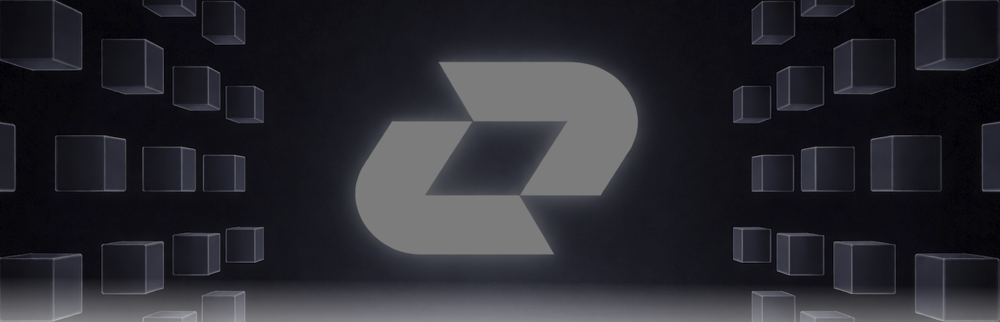

# SSAR Group

  <a href="https://blog.ssar-group.com">Blog</a>
  •
  <a href="https://docs.ssar-group.com">Documentation</a>
  •
  <a href="mailto:contactus@ssar-group.com">Contact</a>

## About Us

SSAR Group develops cutting-edge tools and technologies for game development, software engineering, and online security. Our mission is to empower developers with powerful, reliable solutions while maintaining the integrity of online gaming communities.

## Our Products

### Vecteur Anti-Cheat
A next-generation anti-cheat system powered by artificial intelligence, designed to combat cheating in online games with advanced detection capabilities and minimal performance impact.

[Learn more →](https://dev.ssar-group.com/gamedev/ac-vecteur)

### ASL Framework
A comprehensive utility framework providing developers with essential tools and libraries for modern application development.

[Learn more →](https://dev.ssar-group.com/asl)

### PulsarUI
A modern, React-based UI component library designed for building fast, accessible, and visually appealing user interfaces.

[Learn more →](https://dev.ssar-group.com/pulsarui)

## Open Source Commitment

We actively create, support, and contribute to open source projects across various domains. All our public repositories use status labels to help you understand their current state and maintenance level.

### Repository Status Labels

| Label | Status | Description |
|:------|:-------|:------------|
|  | **Active** | Actively developed and maintained with regular updates, issue reviews, and pull request acceptance |
|  | **Stable** | Production-ready and maintained with bug fixes and security updates; no major feature development planned |
|  | **Experimental** | Work in progress or proof of concept; expect breaking changes and frequent updates |
|  | **Obsolete** | No longer maintained or supported; available for historical reference only |
|  | **Archived** | Read-only repository; no issues or pull requests accepted |

## Documentation

Comprehensive documentation for all our products and services is available at [docs.ssar-group.com](https://docs.ssar-group.com).

## Community & Support

- **Blog**: Stay updated with our latest developments at [blog.ssar-group.com](https://blog.ssar-group.com)
- **General Inquiries**: [contactus@ssar-group.com](mailto:contactus@ssar-group.com)
- **Security Reports**: [security@ssar-group.com](mailto:security@ssar-group.com)

For contribution guidelines and community standards, please review our [Code of Conduct](CODE_OF_CONDUCT.md).
